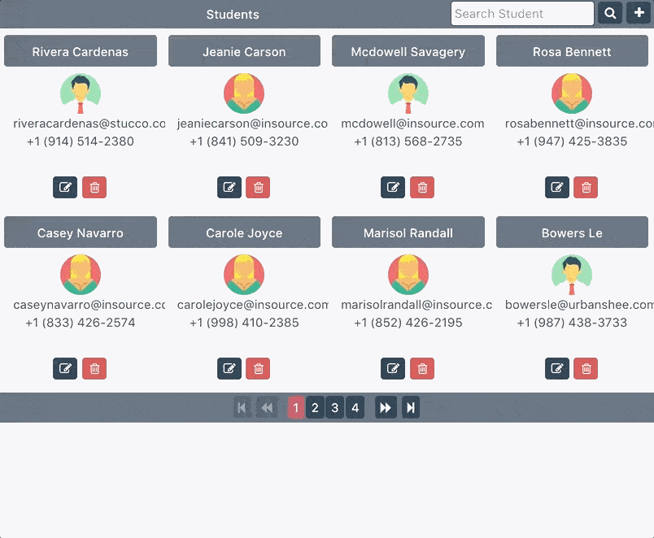

## RESTfulNode



### APIs

```
GET /students

POST /students

PUT /students

DELETE /students
```


### Search Student

```
GET /api/student/search?q=term
```

### Running Server
First run `npm init` to install dependencies then run the following command:


```py
node server
```
You may also run `nodemon server` if you are developing.

### Dev Testing

```
npm test
```

### Using via Postman
Download app.postman_collection_vX.json file and import into postman app.

## RESTfulNode

This project was generated with [Angular CLI](https://github.com/angular/angular-cli) version 1.4.7.

## Development server

Run `ng serve` for a dev server. Navigate to `http://localhost:4200/`. The app will automatically reload if you change any of the source files.

## Code scaffolding

Run `ng generate component component-name` to generate a new component. You can also use `ng generate directive|pipe|service|class|guard|interface|enum|module`.

## Build

Run `ng build` to build the project. The build artifacts will be stored in the `dist/` directory. Use the `-prod` flag for a production build.

## Running unit tests

Run `ng test` to execute the unit tests via [Karma](https://karma-runner.github.io).

